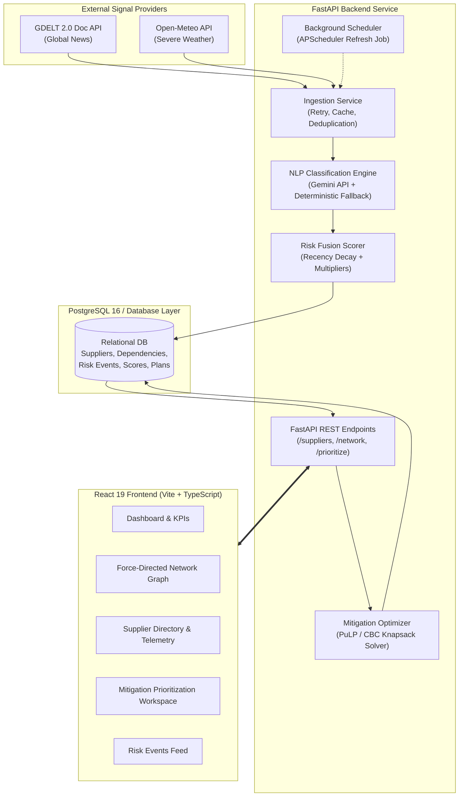

# SentinelX

> Real-time supply-chain risk intelligence and linear-programming mitigation prioritization platform.

SentinelX fuses real-time global news, weather, and logistics disruption signals into explainable supplier risk scores, maps multi-tier supplier dependencies across critical global manufacturing corridors, and solves a constrained resource allocation problem (PuLP 0-1 Knapsack) to identify which disrupted suppliers to mitigate under strict capital budgets to protect the maximum business revenue.

---

## Overview

Modern high-reliability electronics manufacturing involves geographically distributed, multi-tiered supplier networks. Regional shocks—including geopolitical chokepoints, severe meteorological events, labor strikes, and component shortages—propagate rapidly through dependencies into finished product assembly lines.

SentinelX provides an end-to-end intelligence pipeline that:
1. **Ingests** real-world external risk signals from the GDELT 2.0 Document API and Open-Meteo Weather API without requiring paid third-party access.
2. **Classifies** disruption events across a 6-category taxonomy using Google Gemini structured outputs with an offline deterministic rules fallback.
3. **Calculates** dynamic 0–100 supplier risk scores via multi-signal exponential recency decay, sublinear diminishing returns, and criticality tier amplification.
4. **Visualizes** multi-tier supplier-to-product dependencies through an interactive 2D force-directed dependency network graph.
5. **Prioritizes** capital mitigation expenditures using integer linear programming (PuLP / CBC branch-and-bound solver) to maximize protected revenue under tight budget constraints.
6. **Validates** the risk-scoring methodology retrospectively against documented historical global supply chain disruptions (Suez Canal 2021, Red Sea 2024, Typhoon Gaemi 2024, US ILA Port Strike 2024).

---

## Core Capabilities

- **Live Risk Signal Ingestion**: Automated multi-source polling across global manufacturing corridors (`East Asia`, `Southeast Asia`, `North America`, `Europe`) with exponential backoff retries, SHA-256 fingerprint deduplication, and provider failure isolation.
- **NLP Event Classification**: Hybrid classification architecture using Google Gemini structured JSON outputs (`category`, `severity`, `confidence`) with an automated deterministic keyword and rules fallback that guarantees uninterrupted operation if external APIs are unreachable.
- **Supplier Risk Fusion**: Mathematically bounded 0–100 risk fusion combining event severity, DistilRoBERTa sentiment analysis, 14-day exponential recency decay, and supplier criticality tier multipliers ($M_{\text{tier}} \in \{0.90, 1.10, 1.30\}$).
- **Interactive Dependency Network**: Custom force-directed dependency graph rendering 24 component suppliers, 44 multi-tier product dependency links, and 4 product line sinks with $O(1)$ hover highlight clustering and camera controls.
- **Constrained Mitigation Optimization**: PuLP/CBC mathematical optimization engine executing a 0-1 Knapsack resource allocation model that maximizes expected protected business revenue under finite mitigation budgets.
- **Historical Risk Trends & Snapshots**: Automated snapshot persistence generating chronological risk trajectories and regional exposure distributions across historical refresh cycles.
- **Retrospective Historical Backtest**: Offline evaluation suite validating risk sensitivity, recency decay, and criticality amplification against four documented historical supply chain disruptions.
- **Executive Command Dashboard**: Responsive single-page application built with React 19, TypeScript, Tailwind CSS, Framer Motion, and Recharts, providing instant fleet telemetry and operational drill-downs.

---

## Architecture

SentinelX uses a decoupled client-server architecture with an asynchronous ingestion and optimization pipeline.



---

## Risk Scoring Methodology

The risk engine computes dynamic, explainable supplier risk scores ($R_{\text{final}} \in [0, 100]$) without black-box heuristics:

### 1. Event Risk Contribution ($E_i \in [0, 100]$)
For meteorological events, classified severity maps directly to base risk:
$$E_{\text{weather}} = \text{clamp}_{[0, 100]}(\text{severity})$$

For geopolitical, labor, logistics, and supply events, negative sentiment amplifies disruption severity:
$$E_{\text{news}} = 0.65 \times \text{severity} + 0.35 \times \max(0, -\text{sentiment} \times 100)$$
where $\text{sentiment} \in [-1.0, +1.0]$ is derived from the NLP pipeline.

### 2. Exponential Recency Weighting ($w_t \in [0.10, 1.0]$)
Disruption signals decay exponentially with a 14-day half-life ($\lambda = \frac{\ln(2)}{14} \approx 0.04951$):
$$w_t = \max\left(0.10, \min\left(1.0, \exp(-\lambda \cdot \Delta t)\right)\right)$$
where $\Delta t = \max(0, t_{\text{current}} - t_{\text{detected}})$ is the elapsed time in days.

### 3. Multi-Event Diminishing Returns Aggregation ($R_{\text{raw}} \in [0, 100]$)
Concurrent events within the same corridor combine with sublinear diminishing returns to prevent artificial score runaway:
$$R_{\text{raw}} = 100 \times \left(1 - \prod_{i} \left(1 - \frac{E_i \cdot w_{t,i}}{100}\right)\right)$$

### 4. Criticality Tier Amplification ($R_{\text{final}} \in [0, 100]$)
Suppliers are classified into three operational criticality tiers:
- **Tier 1 ($M = 1.30$)**: Single-source or core semiconductor/battery suppliers (+30% amplification).
- **Tier 2 ($M = 1.10$)**: Major component or display manufacturers (+10% amplification).
- **Tier 3 ($M = 0.90$)**: Standard commodity or packaging vendors (-10% exposure reduction).

The final score is bounded strictly between 0 and 100:
$$R_{\text{final}} = \min(100.0, R_{\text{raw}} \times M_{\text{tier}})$$

*Invariant*: If $R_{\text{raw}} = 0$, then $R_{\text{final}} = 0$. Criticality amplifies existing exposure; it never fabricates risk out of nothing.

---

## Constrained Mitigation Optimization

When supply corridors experience concurrent disruptions, mitigating all affected nodes simultaneously is impossible under finite capital constraints. SentinelX formulates this as a 0-1 Knapsack problem solved via branch-and-bound in PuLP:

### Mathematical Formulation
$$\max \sum_{i \in S} \left(\text{ExpectedProtectedRevenue}_i \cdot x_i\right)$$

$$\text{subject to} \quad \sum_{i \in S} \left(\text{MitigationCost}_i \cdot x_i\right) \le B$$

$$x_i \in \{0, 1\} \quad \forall i \in S$$

where:
- $S$ is the set of candidate suppliers evaluated for mitigation.
- $B$ is the allocated capital mitigation budget in USD ($B \ge 0$).
- $x_i = 1$ indicates that supplier $i$ is selected for immediate mitigation action.

### Financial Metric Derivations
1. **Financial Risk Exposure**:
   $$\text{RiskExposure}_i = \left(\frac{R_{\text{final}, i}}{100}\right) \times \text{DependencyImpact}_i \times \text{AnnualSpend}_i$$
   where $\text{DependencyImpact}_i = \max\left(1.0, \sum_{d \in D_i} \text{weight}_d\right)$ aggregates downstream product line importance.
2. **Mitigation Cost ($C_i$)**: Derived from supplier criticality tier and annual procurement volume ($2\%\text{--}8\%$ of annual spend).
3. **Mitigation Effectiveness**: Disruption recovery reduction factor based on supplier category and tier ($60\%\text{--}85\%$).
4. **Expected Protected Revenue**:
   $$\text{ExpectedProtectedRevenue}_i = \text{RiskExposure}_i \times \text{MitigationEffectiveness}_i$$
5. **Efficiency ROI Multiple**:
   $$\text{ROI}_i = \frac{\text{ExpectedProtectedRevenue}_i}{C_i}$$

---

## Historical Validation

SentinelX includes an automated offline evaluation suite verifying that the production scoring pipeline behaves coherently under documented historical disruptions.

### Documented Historical Cases
1. **2021 Suez Canal Obstruction (*Ever Given*)**: Logistics maritime chokepoint blockage halting ~12% of global trade. Source: Lloyd's List Intelligence / Suez Canal Authority.
2. **2024 Red Sea Maritime Chokepoint Crisis**: Concurrent geopolitical strikes and logistics Cape of Good Hope container detours. Source: UNCTAD / Reuters.
3. **2024 Typhoon Gaemi (Carina)**: Category 4 equivalent super typhoon halting Taiwanese container ports and manufacturing. Source: Central Weather Administration (Taiwan) / Bloomberg.
4. **2024 US East & Gulf Coast ILA Port Strike**: Labor walkout across 36 container ports from Maine to Texas. Source: US Maritime Alliance / ILA.

### Evaluation Results Summary

| Case ID | Tier | Mult | Representative Supplier | Baseline | Peak Disruption | Post-Event (+14d) | Decay (+28d) | Risk Delta ($\Delta$) |
| :--- | :---: | :---: | :--- | :---: | :---: | :---: | :---: | :---: |
| **`case_red_sea_2024`** | T1 | 1.3 | Eindhoven Litho Circuits | 0.0 | 76.3 | 32.2 | 19.6 | **+76.3** |
| `case_red_sea_2024` | T2 | 1.1 | Bavaria Sensor Dynamics | 0.0 | 64.6 | 27.2 | 16.6 | **+64.6** |
| `case_red_sea_2024` | T3 | 0.9 | Nordic Green Packaging | 0.0 | 52.8 | 22.3 | 13.6 | **+52.8** |
| **`case_suez_2021`** | T1 | 1.3 | Eindhoven Litho Circuits | 0.0 | 92.2 | 41.7 | 20.9 | **+92.2** |
| `case_suez_2021` | T2 | 1.1 | Bavaria Sensor Dynamics | 0.0 | 78.0 | 35.3 | 17.7 | **+78.0** |
| `case_suez_2021` | T3 | 0.9 | Nordic Green Packaging | 0.0 | 63.8 | 28.9 | 14.4 | **+63.8** |
| **`case_typhoon_gaemi_2024`** | T1 | 1.3 | Pacific Silicon Foundry | 0.0 | 100.0 | 52.8 | 26.4 | **+100.0** |
| `case_typhoon_gaemi_2024` | T3 | 0.9 | Tokyo Nano-Capacitors | 0.0 | 75.9 | 36.6 | 18.3 | **+75.9** |
| **`case_us_ila_strike_2024`** | T1 | 1.3 | Silicon Valley RF Labs | 0.0 | 100.0 | 73.1 | 40.3 | **+100.0** |
| `case_us_ila_strike_2024` | T2 | 1.1 | Austin Power Systems | 0.0 | 100.0 | 61.8 | 34.1 | **+100.0** |
| `case_us_ila_strike_2024` | T3 | 0.9 | Monterrey Polymer Enclosures | 0.0 | 82.5 | 50.6 | 27.9 | **+82.5** |

*Methodological Scope Notice*: This backtest is a retrospective behavioral validation demonstrating that the scoring pipeline responds to real-world signals as designed. It does **not** claim future predictive forecasting accuracy. For complete case notes and provenance, see [`docs/HISTORICAL_VALIDATION.md`](docs/HISTORICAL_VALIDATION.md).

---

## Technology Stack

| Layer | Technologies |
| :--- | :--- |
| **Backend Core** | Python 3.11+, FastAPI, Pydantic v2, Uvicorn, APScheduler |
| **Data & ORM** | PostgreSQL 16, SQLAlchemy 2.0, Alembic |
| **Optimization** | PuLP (Coin-OR CBC Branch-and-Bound Linear Programming Solver) |
| **NLP & AI** | HuggingFace Transformers (DistilRoBERTa), Google Gemini API (Structured Outputs) + Deterministic Fallback |
| **Frontend Core** | React 19, TypeScript, Vite, Tailwind CSS, shadcn/ui design patterns |
| **Visualizations** | `react-force-graph-2d` (HTML5 Canvas dependency graph), Recharts (SVG analytics) |
| **Motion & UX** | Framer Motion, Lucide React, WCAG 2.1 AA accessible reduced motion |
| **Code Quality** | pytest, Oxlint (sub-100ms static analysis), tsc |

---

## REST API Reference

| Method | Endpoint | Description |
| :--- | :--- | :--- |
| `GET` | `/health` | Core system liveness and database connectivity check |
| `GET` | `/api/v1/health` | Versioned API health and provider readiness probe |
| `GET` | `/suppliers` | Paginated list of suppliers with current risk scores (`limit`, `offset`, `region`, `tier`) |
| `GET` | `/suppliers/{id}` | Detailed supplier telemetry, contributing risk factors, and product line dependencies |
| `GET` | `/network` | Multi-tier dependency graph payload (nodes and weighted directed edges) |
| `GET` | `/risk-events` | Feed of ingested real-world disruption signals (`region`, `source`, `limit`, `offset`) |
| `GET` | `/dashboard/summary` | Aggregated executive KPIs, corridor averages, and historical risk trends |
| `POST` | `/prioritize` | Solves the 0-1 Knapsack problem for a given capital budget (`{"budget": 500000.0}`) |
| `GET` | `/mitigation-plans/latest` | Retrieves the most recently executed and persisted mitigation plan |

---

## Project Structure

```
sentinelx/
├── .env.example                     # Environment configuration template
├── README.md                        # Project documentation
├── docker-compose.yml               # Multi-container orchestration (DB + Backend + Frontend)
├── docs/
│   └── HISTORICAL_VALIDATION.md     # In-depth historical backtest validation report
├── backend/
│   ├── Dockerfile
│   ├── requirements.txt
│   ├── alembic/                     # Database migration scripts
│   ├── app/
│   │   ├── api/                     # FastAPI route handlers (/suppliers, /network, /prioritize)
│   │   ├── core/                    # App configuration, database sessions, scheduler
│   │   ├── data/                    # Seed data (24 suppliers, 44 product dependencies)
│   │   ├── evaluation/              # Module wrapper for backtest execution
│   │   ├── ingestion/               # GDELT and Open-Meteo ingestion services
│   │   ├── models/                  # SQLAlchemy ORM models
│   │   ├── nlp/                     # Gemini classification, sentiment, and risk fusion
│   │   ├── schemas/                 # Pydantic v2 validation models
│   │   ├── services/                # Business logic (optimization, dashboard aggregation)
│   │   └── main.py                  # Application entry point and exception handlers
│   ├── evaluation/
│   │   ├── cases/                   # Documented historical disruption fixtures (JSON)
│   │   ├── results/                 # Generated validation outputs (JSON and CSV)
│   │   └── backtest.py              # Offline historical evaluation engine
│   └── tests/                       # Automated pytest test suites (101 passing tests)
└── frontend/
    ├── Dockerfile
    ├── package.json
    ├── vite.config.ts
    └── src/
        ├── api/                     # Type-safe API client
        ├── components/              # Reusable UI primitives (AppShell, Navbar, StatCard)
        ├── pages/                   # Application pages (Dashboard, Network, Prioritization)
        └── lib/                     # Tokens, motion presets, and risk formatting
```

---

## Local Setup & Reproducibility

### Prerequisites
- Python 3.11+
- Node.js 18+ & npm
- PostgreSQL 16 (or Docker)

### Option A: Running with Docker Compose (Recommended)

1. **Clone the repository**:
   ```bash
   git clone https://github.com/yourusername/sentinelx.git
   cd sentinelx
   ```

2. **Configure environment variables**:
   ```bash
   cp .env.example .env
   ```

3. **Start services**:
   ```bash
   docker compose up --build
   ```
   - Frontend: `http://localhost:5173`
   - Backend API: `http://localhost:8000`
   - Swagger Documentation: `http://localhost:8000/docs`

---

### Option B: Running Locally from Source

#### 1. Backend Setup

```bash
cd backend

# Create virtual environment
python3 -m venv venv
source venv/bin/activate

# Install dependencies
pip install -r requirements.txt

# Configure environment
cp ../.env.example .env

# Run database migrations
alembic upgrade head

# Seed initial suppliers and dependency topology
python -m app.seed

# Start the FastAPI server
uvicorn app.main:app --host 0.0.0.0 --port 8000 --reload
```

*Note on In-Memory Mode*: For local evaluation and testing without a running PostgreSQL instance, SentinelX automatically supports in-memory SQLite for test runs and offline backtests.

#### 2. Frontend Setup

```bash
cd ../frontend

# Install dependencies
npm install

# Start development server
npm run dev
```
Open `http://localhost:5173` in your browser.

---

## Testing & Quality Assurance

SentinelX includes comprehensive test suites across backend logic, optimization constraints, API schemas, and frontend build pipelines.

### Run Backend Tests (101 Passing Tests)
```bash
cd backend
./venv/bin/pytest -v
```
Verified test suites cover:
- **Optimization & Knapsack Solver**: Infeasible budgets, zero budget, budget constraint adherence, deterministic allocations.
- **Risk Fusion Engine**: Recency decay mathematical bounds, criticality multipliers, sublinear multi-event compounding, NaN/Inf immunity.
- **Signal Ingestion**: GDELT normalization, Open-Meteo failure isolation, SHA-256 deduplication, caching.
- **Hardening & Security**: Pagination upper limits, malformed UUID rejection, sanitized 500 error responses without information leakage.
- **Historical Backtest**: Fixture integrity, chronological validation, deterministic output generation.

### Run Historical Backtest Evaluation
```bash
cd backend
./venv/bin/python -m app.evaluation.backtest
```
Regenerates:
- `backend/evaluation/results/historical_validation_results.json`
- `backend/evaluation/results/historical_validation_summary.csv`

### Run Frontend Static Analysis & Production Build
```bash
cd frontend

# TypeScript check
npx tsc -b

# Oxlint static analysis
npm run lint

# Production bundle build
npm run build
```

---

## Data Sources

| Provider | Data Ingested | Key Required | Fallback Mechanism |
| :--- | :--- | :---: | :--- |
| **GDELT 2.0 Doc API** | Real-time global trade, logistics, and labor news | No | Graceful isolation per provider; does not abort pipeline |
| **Open-Meteo API** | Extreme weather, gales, typhoons, and precipitation | No | Isolated per corridor; skips unaffected regions |
| **Google Gemini API** | Zero-shot event classification & severity extraction | Optional | Deterministic rule-based keyword & pattern matcher |
| **Historical Sources** | UNCTAD, Lloyd's List, Suez Canal Authority, CWA, USMX | No | Immutable local fixtures in `backend/evaluation/cases/` |

---

## Important Disclaimers

1. **Hypothetical Enterprise Model**: SentinelX models a hypothetical mid-size consumer electronics manufacturer. The 24 suppliers, 44 product component dependencies, and 4 product lines are representative of real-world supply chain topologies but are synthetic.
2. **Synthetic Financial Values**: Supplier procurement spends, financial exposures, and mitigation cost percentages are illustrative figures modeled for realistic knapsack resource allocation.
3. **Retrospective Evaluation, Not Prediction**: Historical backtest results evaluate the retrospective sensitivity of the mathematical scoring pipeline to historical events. They do not represent forward-looking predictive guarantees or statistical forecasting claims.

---

## Limitations

- **Geographic Corridor Granularity**: Ingestion currently maps signals onto continental corridors (`East Asia`, `Southeast Asia`, `North America`, `Europe`). Highly localized events elevate corridor supplier exposure unless country-level or facility-level geolocation coordinates are provided.
- **External API Rate Limits**: Public GDELT and Open-Meteo endpoints are subject to upstream latency and availability. SentinelX isolates provider errors, but live signal density depends on upstream provider uptime.
- **Absence of Proprietary ERP Telemetry**: SentinelX does not directly integrate with proprietary internal ERP databases (e.g. SAP S/4HANA) or real-time GPS container tracking devices; operational inputs rely on public external signals.

---

## License

This project is licensed under the MIT License. See [LICENSE](LICENSE) for details.
